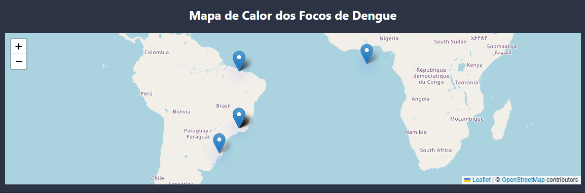

<!-- Banner animado topo -->


<p align="center">
  <a href="https://github.com/diatsilva007">
    
  </a>
</p>


<p align="center">
  
  
  
</p>

## 👨‍💻 About me

```js
const diogo = {
  role: "Software Engineer",
  location: "Andrelândia, MG - Brazil",

  mainStack: [
    "JavaScript",
    "TypeScript",
    "React",
    "Node.js",
    "Docker",
    "AWS",
    "AI"
  ],

  focusAreas: [
    "Software Engineering",
    "Full-Stack Development",
    "Cloud Architecture",
    "DevOps",
    "Microservices",
    "Clean Architecture",
    "System Design",
    "SaaS Platforms"
  ],

  currentlyLearning: [
    "Kubernetes",
    "CI/CD",
    "Scalable Systems",
    "Security",
    "AI Integration"
  ],

  mission:
    "Build scalable, secure and impactful digital products."
};

console.log("Engineering modern software solutions.");
```

---

# 🚀 What I Build

✅ Full-Stack Web Applications  
✅ REST APIs & Backend Services  
✅ SaaS Platforms  
✅ Cloud-Native Applications  
✅ Automation Systems  
✅ Responsive & Mobile-First Interfaces  
✅ Scalable Software Architectures  
✅ DevOps & CI/CD Workflows  

---

## 🧠 Technology Stack

### 💻 Development

[](https://skillicons.dev)

### 📱 Mobile

[](https://skillicons.dev)

### 🗄️ Databases & ORM

[](https://skillicons.dev)

### ☁️ Cloud & DevOps

[](https://skillicons.dev)

### 🏗️ Architecture & Engineering


### 🔐 Security

[](https://skillicons.dev)


### 🛠️ Tools

[](https://skillicons.dev)

---

## 🚀 Featured Project

<h3 align="center">🦟 Foco Zero</h3>

<p align="center">
  <strong>
    Intelligent system for dengue control and epidemiological surveillance
  </strong>
</p>

<p align="center">
  <a href="https://foco-zero.vercel.app/login">
    
  </a>
</p>

<p align="center">
  Foco Zero is a web application designed to support epidemiological
  surveillance through geographic data collection, visualization and analysis.
</p>

### ✨ Highlights

- 🦟 Dengue surveillance and monitoring
- 📍 Geographic data collection with latitude and longitude
- 🗺️ Interactive heat map visualization
- 📊 Epidemiological data analysis
- 🎯 Support for preventive decision-making
- 📱 Responsive web interface

### 🛠️ Tech Stack

`React` · `JavaScript` · `REST API` · `Maps` · `Geolocation`

<p align="center">
  <a href="https://foco-zero.vercel.app/login">
    🌐 <strong>Live Demo</strong>
  </a>
  &nbsp;&nbsp;•&nbsp;&nbsp;
  <a href="https://github.com/diatsilva007/foco-zero">
    💻 <strong>Source Code</strong>
  </a>
</p>

---

## 📊 Stats

<div align="center">

  <a href="https://github-stats-extended.vercel.app/api?username=diatsilva007&rank_icon=percentile&custom_title=Diogo%20Ataide%20Silva%20-%20My%20GitHub%20Stats&include_all_commits=true&theme=neon">
    
  </a>

  <a href="https://github-stats-extended.vercel.app/api/top-langs?username=diatsilva007&layout=compact&langs_count=20&theme=neon">
    
  </a>

  <br>

  <a href="https://spotify-github-profile.kittinanx.com/api/view?uid=diogo_ataide&redirect=true">
    
  </a>

</div>

---

# 🤝 Open To

- Remote Opportunities
- Full-Stack Positions
- Freelance Projects
- SaaS Partnerships
- Tech Networking
- International Opportunities

---

## 📫 Contact
  
[](https://www.linkedin.com/in/diatsilva)
[](https://www.diogoataide.dev)
[](mailto:diogo.ataidee@gmail.com)

---

## 💡 Philosophy

> “Build the future you'd like to live in - one line of code at a time." 🚀

---


----------------------------------------------------------------------------------------------------------------------------------------------------------------------------------------------------------------------------------------------------------------
